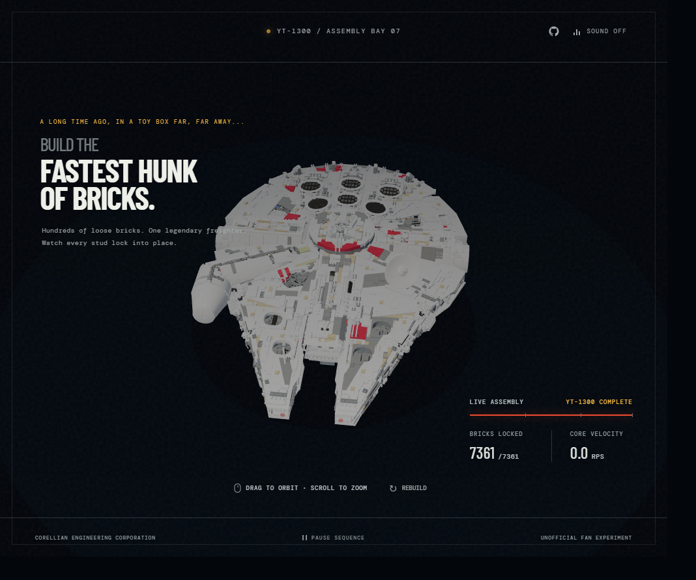
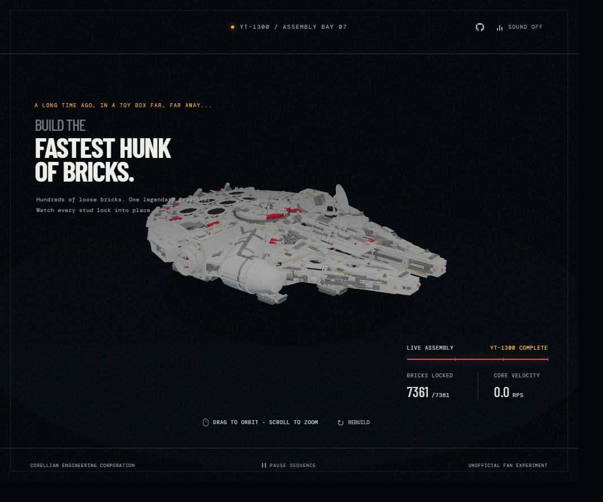

# LEGO Millennium Falcon Assembly

An interactive, real-time reconstruction of the LEGO 75192 Millennium Falcon in the browser. The experience turns 7,361 individual pieces into a choreographed assembly sequence: every brick begins in a wide orbital field, moves through a collapsing vortex, and locks into its authored position bag by bag.



This is not a pre-rendered animation or a single exported ship mesh. The Falcon is rebuilt from the original part transforms at runtime and rendered as thousands of independently animated instances.

## The model at a glance

- 7,361 rendered parts
- 405 unique brick geometries
- 673 geometry and material instance groups
- 24 materials, including transparent and metallic variants
- 17 construction bags preserved from the source hierarchy
- 0.88 MB scene manifest
- 4.32 MB compressed geometry archive
- 22-second continuously looping assembly sequence

The completed model spans roughly 591 × 200 × 813 scene units. Its silhouette, surface layering, cockpit, sensor dish, engine details, exposed machinery, and asymmetrical hull markings remain composed of the actual underlying pieces.



## From construction model to browser scene

The source model is the [LEGO 75192 Millennium Falcon published on Mecabricks](https://mecabricks.com/en/models/87X2RWRqjZY). Mecabricks exports contain considerably more information than a browser renderer needs: a nested object hierarchy, a large shared geometry library, material definitions, accessories, flexible elements, and transforms distributed across parent objects.

`tools/prepare-model.py` converts that source into a deliberately small runtime format.

### 1. Recovering the final placement

Every part stores a local 4 × 4 transform. The preparation script walks the object hierarchy and multiplies each local matrix by its ancestors to recover the final world-space transform. These matrices are retained rather than baking the entire ship into one mesh; that decision is what allows each brick to be animated independently later.

The same hierarchy contains the numbered construction bags. Their identifiers are attached to each exported instance and become the broad timing structure of the animation.

### 2. Keeping only the ship

The original scene includes minifigures, accessories, and optional display assemblies positioned beside the Falcon. The preparation step filters those detached objects so the runtime bounds and animation are based on the ship itself.

Two flexible families require special handling. Rear engine hoses and protective lattices depend on Mecabricks deformation data that is not directly usable by Three.js, so the converter preserves their Bézier control points instead of exporting a static mesh. The browser reconstructs them with tube geometry and procedural lattice rungs.

### 3. Deduplicating the pieces

Repeated bricks share geometry. The converter groups parts by geometry and material combination, then stores only:

- One geometry reference per unique brick shape
- One compact transform matrix per occurrence
- Its construction bag number
- The material references required by that geometry

The result is `assets/falcon/scene.json`, which describes the scene, and `assets/falcon/geometries.zip`, which contains only the geometry files the final ship actually uses. Deflate compression is applied at its highest standard level.

## Runtime reconstruction

The browser loads the manifest and geometry archive in parallel. JSZip expands the required files in memory, while a custom legacy-geometry parser translates the Mecabricks/Three.js face format into modern `BufferGeometry`.

That parser handles:

- Triangle and quad face records
- Material groups
- Face and per-vertex normals
- Legacy UV and color fields
- Quad triangulation
- Normal generation when source normals are unavailable

Each geometry/material combination becomes a `THREE.InstancedMesh`. This keeps the ship faithful to its thousands of source pieces without issuing a separate draw call for every brick. Instance matrices use dynamic draw mode because they are rewritten throughout the assembly.

No framework, bundler, or backend is involved. Three.js and JSZip are vendored as ES modules, and the complete experience is served as static files.

## Choreographing 7,361 pieces

The animation is deterministic. A small hash function derives each part's starting angle, radius, vertical offset, rotation, and fine timing variation from its stable global index. Reloading the page therefore produces the same composition rather than a different random cloud.

Every brick begins between 620 and 1,540 units from the model center. During assembly:

1. It orbits the ship at its own angular velocity.
2. Its radius collapses as its lock value increases.
3. Its position interpolates toward the authored world transform.
4. Its random starting rotation spherically interpolates toward the final orientation.
5. Its scale grows from half size to its authored scale.

The bags create the large waves of construction; a deterministic per-piece offset prevents every brick in a bag from landing simultaneously. A smoothstep curve softens each arrival, while the interface counts a piece as locked only when it is effectively at its destination.

The 22-second loop is divided into four phases:

- 12% forming the initial vortex
- 60% assembling the ship
- 23% presenting the completed Falcon
- 5% resetting the sequence

The `?complete` query parameter freezes the experience on the completed model, while `?vortex` freezes it near the opening formation. Reduced-motion preferences also present a paused state rather than forcing continuous movement.

## Rendering and atmosphere

The visual treatment is intentionally closer to an engineering-bay presentation than a conventional product viewer.

- ACES filmic tone mapping and sRGB output preserve highlight detail across the pale hull.
- Hemisphere, directional, rim, and warm point lights separate the layered geometry.
- Exponential fog blends the model into a field of 1,100 procedural stars.
- Transparent materials retain reduced opacity and disabled depth writing.
- Metallic material categories receive lower roughness and higher metalness.
- The engine material receives a restrained emissive treatment.
- A subtle halo, grain layer, technical frame, and live telemetry connect the WebGL scene to the interface.

Pixel ratio is capped at 1.65 to avoid spending excessive GPU time on very dense displays. The camera uses eased yaw, pitch, and zoom targets so pointer input feels deliberate rather than mechanically attached to the cursor.

## Interaction and sound

Drag anywhere on the canvas to orbit the completed or assembling model, and use the wheel to zoom. The sequence can be paused, resumed, or restarted without reloading the assets.

Sound is opt-in and uses the Web Audio API. A construction track follows the active build phase, fades out when assembly stops, and gives way to a separate completion cue when all 7,361 parts are locked. Audio is loaded only after user interaction to respect browser autoplay policies.

## Project layout

```text
.
├── assets/
│   ├── audio/                 Build and completion sound
│   ├── falcon/
│   │   ├── scene.json         Compact scene and instance manifest
│   │   └── geometries.zip     Deduplicated geometry archive
│   └── vendor/                Browser-ready Three.js and JSZip modules
├── docs/screenshots/          Project imagery used in this document
├── tools/prepare-model.py     Mecabricks-to-runtime conversion pipeline
├── index.html                 Semantic interface structure
├── styles.css                 Responsive presentation and instrumentation
└── script.js                  Loading, reconstruction, animation, audio, and input
```

## Running locally

ES modules, `fetch`, and the ZIP archive require the project to be served over HTTP. From the repository root:

```bash
python -m http.server 4173
```

Then open `http://localhost:4173`.

A current WebGL-capable browser is recommended. There is no dependency installation or build step.

## Data provenance

The model pipeline is based on the [Mecabricks 75192 scene](https://mecabricks.com/en/models/87X2RWRqjZY). LEGO, Millennium Falcon, and Star Wars are trademarks of their respective owners. This repository is an unofficial, non-commercial fan experiment and is not affiliated with or endorsed by the LEGO Group, Lucasfilm, or Disney.
